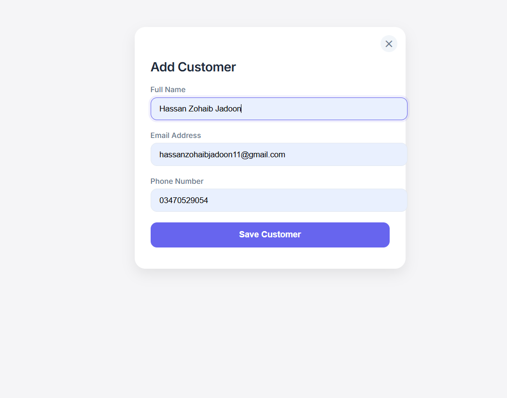
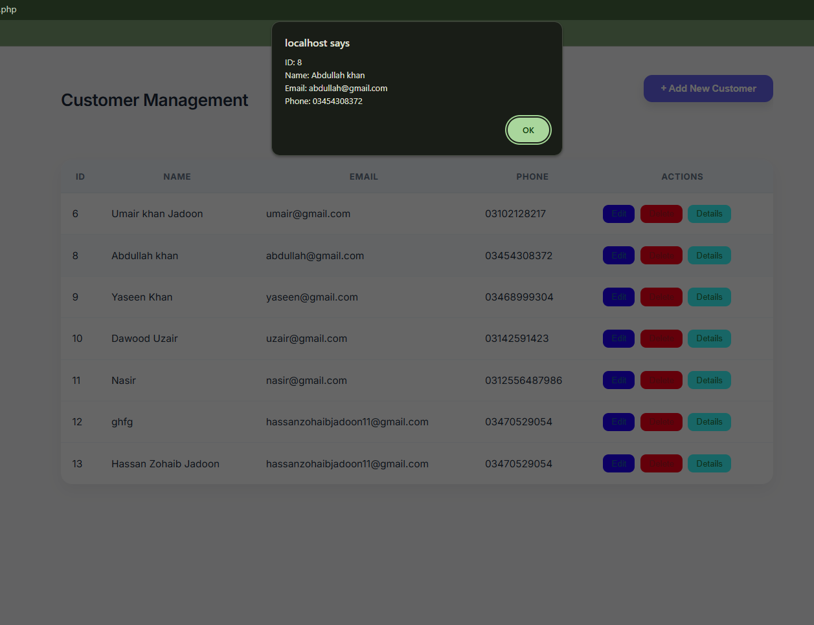
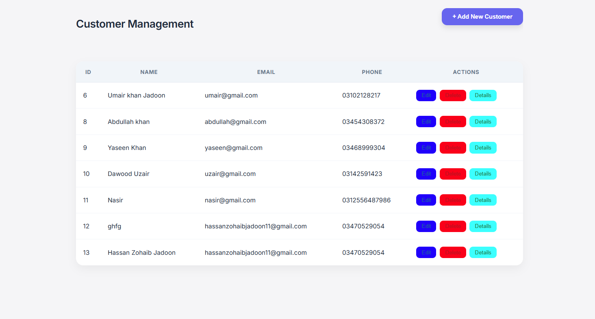
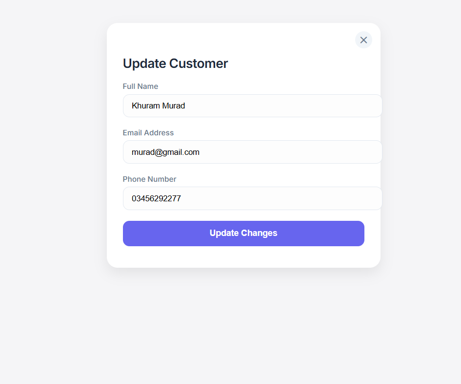
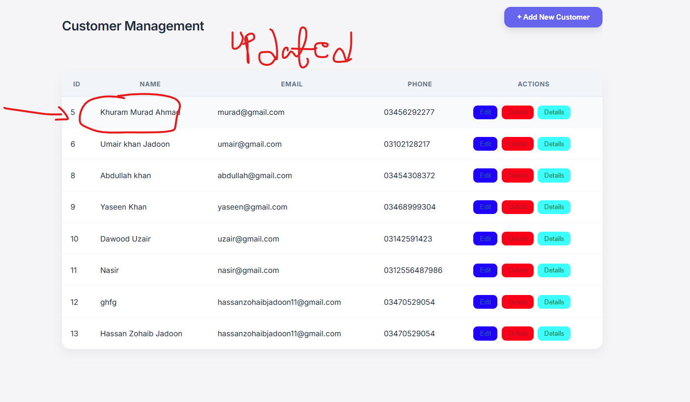
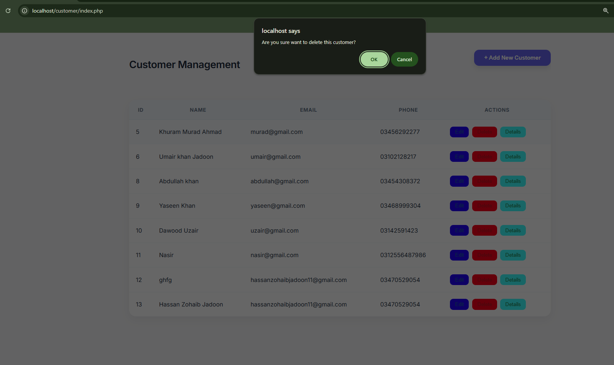
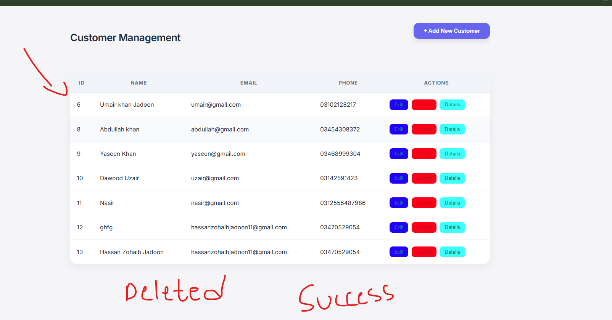

# Customer Management System

A simple Customer Management System using PHP, jQuery, and file-based storage. This project allows you to add, update, delete, and view details of customers in a user-friendly interface.

---

# Features

- Add new customer (Name, Email, Phone)

- Update existing customer information

- Delete a customer

- View customer details (popup alert)

- Dynamic table updates using AJAX

- File-based data storage (customers.txt) – no database required

---

# Technologies Used

## Frontend

- jQuery
-
- HTML5

- CSS3

## Backend

- PHP – Server-side scripting & CRUD logic
- File Handling – PHP fopen, fwrite, fgets for storing customer data

---

# Project Structure

customer/
│
├── class.php # PHP class for CRUD operations
├── server.php # Handles AJAX requests
├── index.php # Main HTML & jQuery interface
├── style.css # Styling for form and table
├── customers.txt # Data storage for customers
├── jquerylibrary.js # jQuery library
├── screenshots/ # Folder containing screenshots of app
└── README.md # Project documentation

---

# Installation Guide

## Clone Repository

Clone or download the repository to your local server directory:

git clone https://github.com/HassanZohaibJadooni/customer.git

Ensure PHP environment is running (e.g., XAMPP, WAMP, MAMP).

Open your project in the browser:

http://localhost/customer/index.php

Make sure customers.txt has write permission so PHP can store data.

Start managing customers – Add, edit, delete, or view details dynamically.

```
---

Screenshots

Screenshots showing functionality of the project should be saved in screenshots/ folder. Example:

Add New Customer



Detail View An Customer



Customer table



Edit Customer



Edit Customer



Before Deleted



Deleted Customer



---


👨‍💻 How It Works

Adding a customer – Opens the form → Fill details → Click Add → Table updates automatically.

Editing a customer – Click “Edit” → Form loads customer data → Update → Table refreshes.

Deleting a customer – Click “Delete” → Confirm → Table updates.

Viewing details – Click “Details” → Popup shows full info.

# Author

**Hassan Zohaib Jadoon**

Junior Web Developer
Learning **React JS & Laravel**

GitHub:
https://github.com/HassanZohaibJadooni

---

# Support

If you like this project, consider giving it a **star ⭐ on GitHub**.
```
